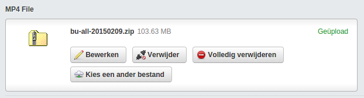

## This module will not be upgraded to Silverstripe 4<br>
**The [FilePond module](https://github.com/lekoala/silverstripe-filepond) is recommended as a replacement.**

Thank you for including this module in your projects over the past seven years.<br>
It's always cool to see your work being used in well over 5000 projects :-)<br>

<br>(packagist data)

# silverstripe-chunkeduploadfield
A Silverstripe UploadField that supports (very) large uploads without fiddling with php.ini



### Silverstripe 3 info
The ChunkedUploadField  hooks into the [jQuery-File-Upload](https://github.com/blueimp/jQuery-File-Upload/wiki/Chunked-file-uploads) module used internally by the standard UploadField. It sets some extra config and hooks into the upload action to add support for uploading large files in chunks.

A video file upload example:
```php
	$mp4field = ChunkedUploadField::create("MP4")->setTitle("MP4 File");
	$mp4field->getValidator()->allowedExtensions = array("mp4");
	$sizeMB = 500 * 1024 * 1024; // 500 MB in bytes
	$mp4field->getValidator()->setAllowedMaxFileSize($sizeMB);
```

By default, the chunk size is set to 90% of php's upload_max_filesize or post_max_size (whichever is smaller). It can be set to a different size:

```php
	// send in chunks of 1 MB each
	$mp4field->setConfig('maxChunkSize', 1 * 1024 * 1024 );
```

##How do chunked uploads work?

The maxChunkSize is auto-set to ca 90% of the upload size permitted by PHP. The File Upload plugin splits up files with a file size bigger than maxChunkSize into multiple blobs and submits each of these blobs to the upload url in sequential order. After the full file has been received and reassembled, the upload handling is passed off to the regular UploadField.
